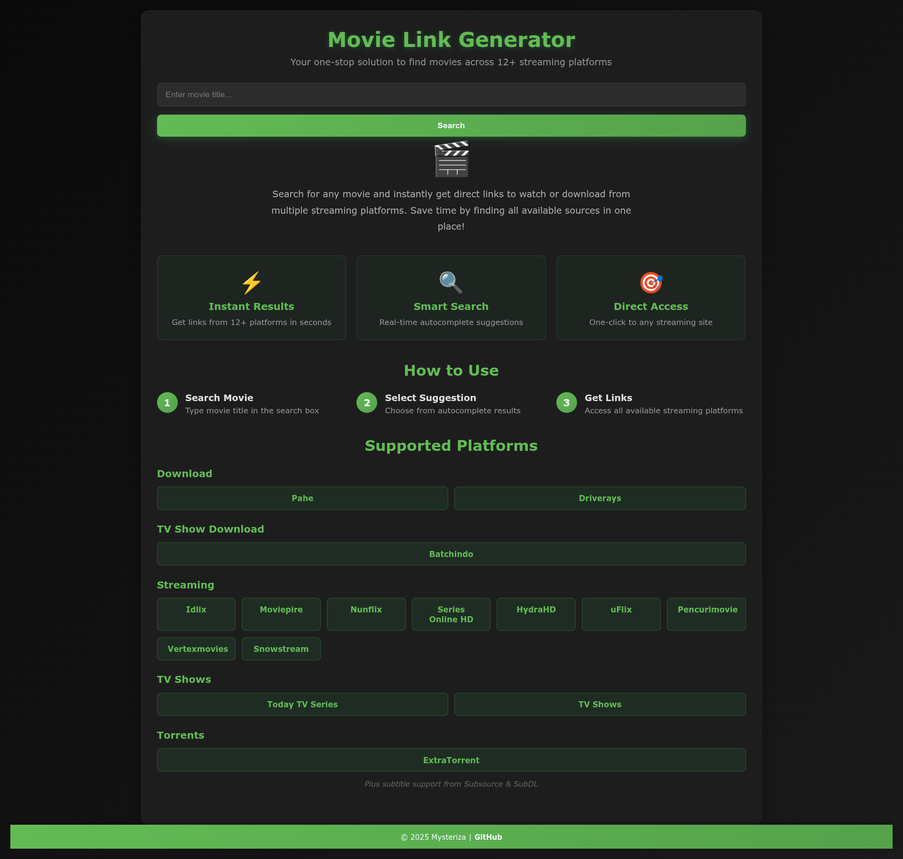
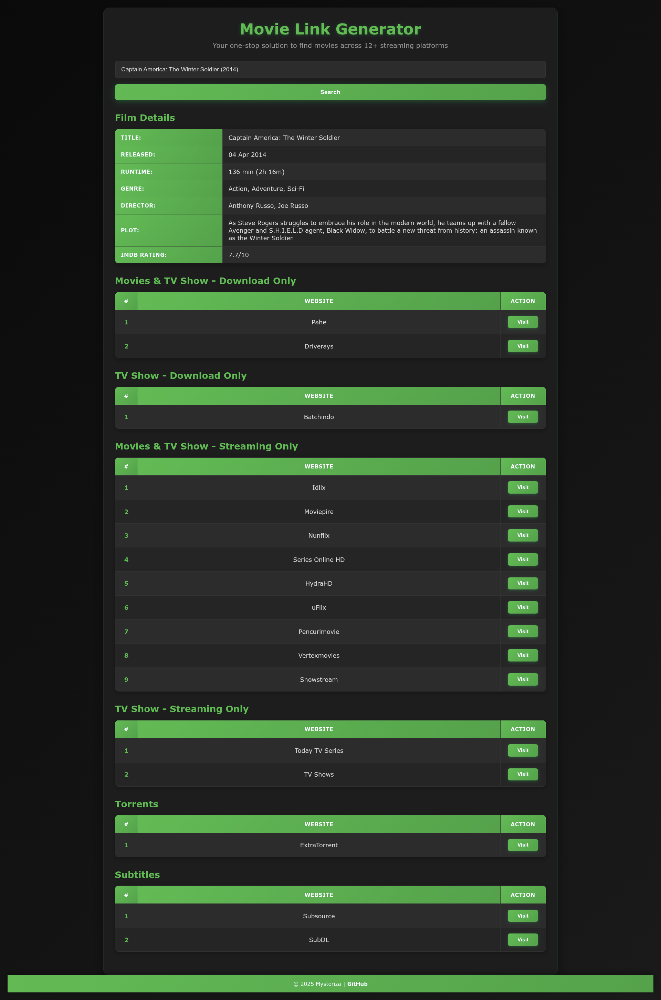
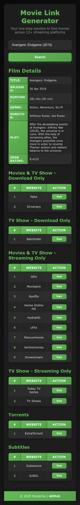

# Movie Search

Movie Link Generator (Movie Search) is a Flask-based web application that helps users automatically search for movie links and subtitles from various popular sites. This application is designed to provide fast and accurate search results with a simple and responsive interface.

You can try it in [Movie Search](https://movie-search.koyeb.app/)

## Key Features

- ✅ **Movie Poster Thumbnails**: Autocomplete suggestions display movie posters for easy identification
- ✅ **Poster in Search Results**: Movie details include poster image alongside film information
- ✅ **Custom Autocomplete**: Rich dropdown with keyboard navigation (arrow keys, enter, escape)
- ✅ **Categorized Platforms**: Organized by Download, TV Show Download, Streaming, TV Shows, Torrents, and Subtitles
- ✅ **15 Streaming Sites**: Pahe, Driverays, Batchindo, Idlix, Moviepire, Nunflix, Series Online HD, HydraHD, uFlix, Pencurimovie, Vertexmovies, Snowstream, Today TV Series, TV Shows, ExtraTorrent
- ✅ **Smart URL Encoding**: Automatic removal of special characters to prevent firewall blocks
- ✅ **Year-based Search**: Autocomplete shows movie year to distinguish similar titles
- ✅ **One-Click Access**: Individual Visit buttons for direct access to each streaming site
- ✅ **Smart Numbering**: Organized list with auto-numbering for easy reference
- ✅ **Autocomplete Search**: Real-time movie suggestions using OMDb API
- ✅ **Movie Details**: Display comprehensive film information (rating, director, plot, etc.)
- ✅ **Modern Dark UI**: Professional gradient design with smooth animations
- ✅ **Fully Responsive**: Optimized for desktop, tablet, and mobile devices
- ✅ **Rate Limiting**: Protection against abuse (10 searches/min, 30 suggestions/min)
- ✅ **Smart Caching**: Faster responses with intelligent caching (templates cached at startup, suggestions cached for 5 minutes)
- ✅ **Security Headers**: Production-grade security implementation with HTTPS API calls

## How to Run Locally

1. **Clone Repository**:

   ```bash
   git clone https://github.com/Mysteriza/movie-search.git && cd movie-search
   ```

2. **Create Virtual Environment** (recommended):

   ```bash
   python3 -m venv venv
   source venv/bin/activate  # On Windows: venv\Scripts\activate
   ```

3. **Install Dependencies**:

   ```bash
   pip install -r requirements.txt
   ```

4. **Create an .env file** in the root directory:

   ```bash
   cp .env.example .env
   ```

   Then edit `.env` and fill it with:

   ```
   OMDB_API_KEY=YOUR_OMDB_API_KEY
   FLASK_ENV=development
   ```

   You can get the API for free [here](https://www.omdbapi.com/apikey.aspx), with a limit of 1000/day.

5. **Run the app**:

   ```bash
   python3 app.py
   ```

6. Open the link: http://127.0.0.1:5000

## Deploy to Koyeb

1. **Fork this repository** to your GitHub account

2. **Go to [Koyeb](https://koyeb.com)** and create a new account (free tier available)

3. **Create a new Web Service:**
   - Connect your GitHub account
   - Select this repository
   - Configure the service:
     - **Build**: `pip install -r requirements.txt`
     - **Run command**: Use the Procfile automatically
     - **Port**: 8000 (or use $PORT environment variable)
4. **Add Environment Variables** in Koyeb dashboard:

   - `OMDB_API_KEY`: Your OMDb API key
   - `FLASK_ENV`: production

5. **Deploy** and wait for the deployment to complete

6. **Access your app** via the provided Koyeb URL

### Important Notes for Koyeb:

- The app uses Gunicorn with optimized settings for Koyeb's free tier
- Health check endpoint available at `/health`
- Rate limiting enabled to prevent abuse
- Caching implemented to reduce API calls

## Screenshots

### Main Page



### Desktop Result View



### Mobile View


